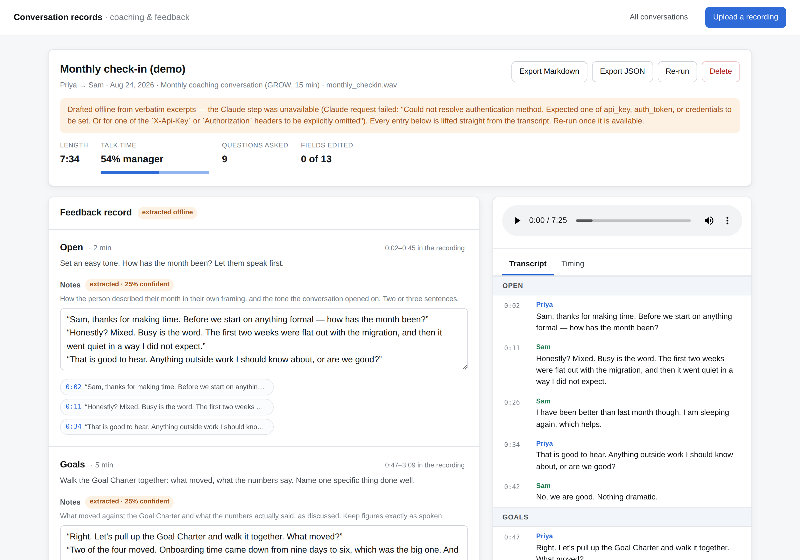
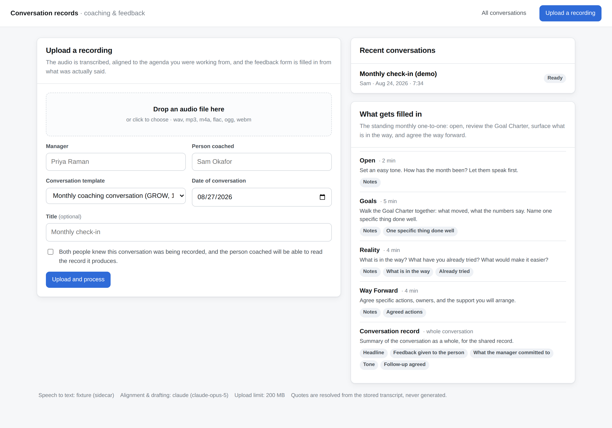

# Conversation records

Upload the recording of a coaching or feedback conversation. The app transcribes
it, aligns the audio to the agenda the manager was working from, and fills in the
feedback form from what was actually said — every answer linked back to the
moment in the recording it came from.

The point is transparency. Today the manager's notes are written after the fact,
from memory, and the person coached rarely sees them. Here the record is drafted
from the recording itself, the manager reviews and edits it, and what changed
between the draft and the final version is on the record.



---

## What it does

```
 recording ──▶ transcribe ──▶ align to the agenda ──▶ draft every field ──▶ manager reviews
                   │                  │                        │                    │
              timestamped        Open · Goals ·          notes, blockers,      edits tracked
               utterances       Reality · Way Forward    actions, feedback      against the draft
```

**Alignment.** The agenda runs in order and does not repeat, so placing the
conversation on it is a monotonic segmentation problem, not a classification
one. Both analysts solve it that way: the offline one with an exact dynamic
program over spoken cues and the planned running order, the Claude one by
picking boundary indices which are then repaired to be monotonic and in range no
matter what comes back.

**Drafting.** Each field in the template carries a brief — what a manager is
meant to record there — and that brief is what the model is asked to answer,
from that part of the conversation only.

**Citations are never generated.** The model returns *segment indices*, and the
application resolves them against the stored transcript. A quote on the record is
therefore always something that was genuinely said, at a timestamp you can click
and hear. This is enforced in `app/pipeline.py::_build_evidence` and covered by
`test_every_citation_matches_the_stored_transcript`.

**The draft and the edit are both kept.** A field stores what the pipeline wrote
(`draft_value`) and what the record currently says (`value`). Editing one never
overwrites the other, so the export can say plainly which entries the manager
changed, and re-running the pipeline leaves edited fields alone.

---

## Running it

```bash
python -m venv .venv && source .venv/bin/activate
pip install -r requirements.txt
cp .env.example .env          # then edit it - see Configuration below

uvicorn app.main:app --reload # http://localhost:8000
```

### See it working without setting anything up

```bash
SPEECH_PROVIDER=fixture python scripts/seed_demo.py
uvicorn app.main:app --reload
```

This loads a worked example: a fifteen-minute GROW check-in between a manager
and a report, with the audio, the aligned transcript, the filled-in form and the
audit trail all populated. The audio is silent — it exists so the player,
seeking and the timeline are real; the words come from
`tests/fixtures/monthly_checkin.txt`.

### Transcribing real audio

```bash
pip install -r requirements-asr.txt   # faster-whisper
export SPEECH_PROVIDER=faster_whisper
```

Transcription runs locally, on the machine running the app. For recordings of
one-to-one conversations that is usually the deciding factor: the audio does not
leave your infrastructure. `WHISPER_MODEL=small` is a reasonable default;
`medium` is noticeably better on accented speech and cross-talk, and slower.

### Drafting with Claude

```bash
export ANALYSIS_PROVIDER=claude
export ANTHROPIC_API_KEY=sk-ant-...   # or run `ant auth login`
```

Without it, set `ANALYSIS_PROVIDER=heuristic` and the app runs entirely offline —
see [Degrading honestly](#degrading-honestly).

---

## Configuration

| Variable | Default | Notes |
|---|---|---|
| `SPEECH_PROVIDER` | `faster_whisper` | or `fixture`, which reads a sidecar transcript next to the audio |
| `WHISPER_MODEL` | `small` | `tiny`/`base`/`small`/`medium`/`large-v3` |
| `WHISPER_DEVICE` | `auto` | `cpu`, `cuda`, or `auto` |
| `WHISPER_COMPUTE_TYPE` | `int8` | `int8` on CPU, `float16` on GPU |
| `ANALYSIS_PROVIDER` | `claude` | or `heuristic` for the fully offline path |
| `ANTHROPIC_API_KEY` | — | unset is fine if you have used `ant auth login` |
| `CLAUDE_MODEL` | `claude-opus-5` | |
| `DATA_DIR` | `./data` | recordings and the SQLite database |
| `DATABASE_URL` | `sqlite:///./data/manager_convo.sqlite3` | any SQLAlchemy URL |
| `MAX_UPLOAD_MB` | `200` | |

---

## Templates

A template is the machine-readable version of the paper form. `app/templates.py`
ships two:

- **`grow-monthly-15`** — the monthly one-to-one: Open (2 min), Goals (5),
  Reality (4), Way Forward (4), plus a whole-conversation record block.
- **`sbi-feedback-20`** — a direct feedback conversation using
  Situation–Behaviour–Impact.

Adding one is a matter of describing it. Nothing else needs to change:

```python
SectionSpec(
    id="reality",
    title="Reality",
    minutes=4,
    prompt="What is in the way? What have you already tried?",
    cues=("in the way", "blocked", "i tried", "stuck"),   # for the offline aligner
    fields=(
        FormFieldSpec(id="notes", label="Notes", kind="text",
                      guidance="How the person described the situation."),
        FormFieldSpec(id="blockers", label="What is in the way", kind="list",
                      guidance="Each obstacle named, one per item."),
    ),
)
```

Field kinds are `text`, `list`, `actions` (action / owner / due / support) and
`choice`. `guidance` does double duty: it is the hint shown under the field in
the UI, and the brief the model is asked to answer.



---

## Degrading honestly

If the Claude call is unavailable or declines, the run does not fail. It
continues on the offline analyst, and the record says so — a banner in the UI, a
`degraded_reason` in the metrics, an entry in the audit trail, and a line in the
export.

The offline analyst is deliberately extractive: it quotes, it does not compose.
Every value it writes is lifted verbatim from the transcript, which is what makes
it safe to fall back to unattended. It is a floor, not a substitute — the
confidence it reports stays low on purpose, and re-running once Claude is
available replaces every field the manager has not edited.

---

## API

| Method | Path | |
|---|---|---|
| `GET` | `/api/templates` | available conversation templates |
| `GET` | `/api/config` | what this deployment is wired up to |
| `POST` | `/api/conversations` | multipart upload; starts processing |
| `GET` | `/api/conversations` | list |
| `GET` | `/api/conversations/{id}` | full record: form, transcript, metrics |
| `GET` | `/api/conversations/{id}/status` | cheap poll target while processing |
| `PATCH` | `/api/conversations/{id}/fields/{field_id}` | edit a field |
| `POST` | `/api/conversations/{id}/fields/{field_id}/revert` | restore the draft |
| `POST` | `/api/conversations/{id}/reprocess` | re-run; edited fields are kept |
| `GET` | `/api/conversations/{id}/audio` | recording, with `Range` support |
| `GET` | `/api/conversations/{id}/audit` | append-only trail |
| `GET` | `/api/conversations/{id}/export.md` | shareable record (`?transcript=true`) |
| `GET` | `/api/conversations/{id}/export.json` | the whole record as data |
| `DELETE` | `/api/conversations/{id}` | record and recording |

Interactive docs at `/docs`.

---

## Layout

```
app/
  templates.py         the agenda and the form, as data
  models.py            Conversation, Segment, FormField, AuditEvent
  pipeline.py          transcribe → align → draft → store, with status and recovery
  transcription/       fixture and faster-whisper providers behind one protocol
  analysis/
    heuristic.py       offline DP aligner, speaker roles, extractive drafter
    claude.py          structured alignment and drafting, plus output repair
    metrics.py         talk ratio, questions, planned vs actual timing
  export.py            Markdown and JSON renderings
  main.py              HTTP API and the web app
  static/              single-page review UI, no build step
scripts/seed_demo.py   loads the worked example
Dockerfile             container image, for any host with a persistent volume
```

---

## Deploying

This is a stateful service, not a set of functions. It needs three things from
its host: a **writable, persistent disk** (recordings and the SQLite database),
a **process that keeps running between requests** (transcription happens in the
background after the upload responds), and **no hard cap on request size or
duration** (a fifteen-minute recording is tens of megabytes and takes minutes to
transcribe).

Any container host with a volume satisfies that. A `Dockerfile` and a
`docker-compose.yml` are included:

```bash
docker compose up --build          # http://localhost:8000
```

The compose file mounts a named volume at `/data`; recordings and the database
survive restarts because of it. Deploying to Render, Railway, Fly.io, a VM, or
your own Kubernetes is the same image — point `DATA_DIR` at the mounted volume
and set `ANTHROPIC_API_KEY`. Most managed hosts inject `$PORT`, which the
container's start command honours.

The first transcription downloads the Whisper model (a few hundred MB for
`small`) into `/data/models`, so give the volume room and expect the first run
after a fresh deploy to be slow.

### Why not Vercel, Netlify Functions, or Lambda

Serverless platforms are a poor fit for this app, and it is worth knowing why
before trying:

| What the app does | What serverless gives it |
|---|---|
| Writes recordings to disk | Read-only filesystem apart from `/tmp`, which is per-instance and wiped |
| Keeps state in SQLite | Same — two requests can land on two instances with two different databases |
| Transcribes in a background thread after responding | The instance is frozen the moment the response is sent; the thread never finishes |
| Runs Whisper locally | Model and dependencies are far over the bundle size limit |
| Accepts a multi-megabyte upload | Request bodies are capped (4.5 MB on Vercel) |

Making it work there means swapping every one of those out: managed Postgres,
object storage with direct-to-bucket uploads, a hosted transcription API, and a
queue with a worker. That is a viable architecture, but it is a different one —
and it ends the property that the audio never leaves your own infrastructure.

---

## Tests

```bash
pip install -r requirements-dev.txt
pytest
```

91 tests, no network and no model download: the fixture speech provider reads a
sidecar transcript, and the Claude analyst is driven by a fake client so the
repair logic (out-of-order boundaries, out-of-range citations, refusals) is
tested directly.

---

## Consent and data

Uploading requires confirming that both people knew the conversation was being
recorded. That is a checkbox, not a legal control — recording a workplace
conversation is regulated differently in different places, and in several
jurisdictions all-party consent is required. Decide the policy before deploying
this, not after.

Everything stays on the machine you run it on: recordings under `DATA_DIR`, the
record in SQLite. With `SPEECH_PROVIDER=faster_whisper` the audio never leaves
that machine. With `ANALYSIS_PROVIDER=claude` the *transcript text* is sent to
the Claude API for alignment and drafting; the audio is not. `ANALYSIS_PROVIDER=heuristic`
sends nothing anywhere.

There is no authentication or per-user access control in this codebase. It
assumes a trusted network. Before real use it needs an identity layer, and a
decision about who can read whose record — the person coached should be able to
read theirs, which is the entire point.
